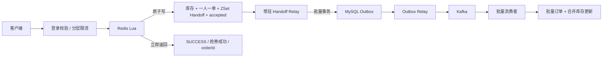

# hmdp-plus

基于黑马点评持续演进的高并发实践项目。项目保留商户、博客、关注、签到和优惠券业务，重点重构了秒杀可靠链路、多级缓存、分布式限流、Redis 高可用与异步批量落库。

这不是只追求一个漂亮 QPS 数字的演示：项目同时验证入口吞吐、责任转移、消息投递、订单落库、库存一致性和故障恢复。

## 核心亮点

- **Redis-only 秒杀入口**：Lua 原子完成活动校验、资格令牌消费、库存预扣、一人一单、ZSet Handoff 与受理凭证写入，成功后立即向用户返回“抢券成功”。
- **可靠异步责任转移**：常驻 Relay 将 Redis ZSet 批量写入 MySQL Transactional Outbox；事务提交后才原子清理 Handoff，Kafka 是系统内唯一 MQ。
- **批量订单落库**：Outbox 批量投递 Kafka，消费者批量监听、合并券库存更新并批量创建订单，整批事务成功后 ACK。
- **可恢复的一致性闭环**：临时故障整批保留并指数退避，数据冲突递归二分，坏事件进入隔离区；低频对账只做兜底，不参与正常请求链路。
- **Redis Sentinel 高可用**：一主二从、三 Sentinel 自动故障转移，业务通过 Sentinel 发现真实主节点。
- **数据库号段 ID**：Tomcat 集群从 MySQL 原子领取不重叠号段，JVM 内生成订单 ID，并在剩余 20% 时异步预取；实例宕机只产生号码空洞，不会冲突。
- **多级缓存与防穿透**：Caffeine L1、Redis L2、共享 Bloom Filter、空值缓存、逻辑过期、Redisson 分布式重建锁与 DCL。
- **分层流量治理**：前置一次性资格令牌，活动/IP/用户维度 Redis 令牌桶，VIP/高价值用户差异化额度，支持运行时调整策略和积压反馈。
- **缓存一致性广播**：商户及秒杀券缓存变更通过 MySQL Outbox + Kafka 可靠广播到各 JVM，本地缓存失效不依赖不可靠的直接通知。
- **营销能力闭环**：到券订阅、候补发券、Top 买家、开抢提醒、站内通知以及取消订单后的双端库存回流。

## 秒杀链路



### 为什么使用 ZSet Handoff

前台只和 Redis 交互后，系统必须解决“Redis 已预扣，但 MySQL 尚未记录”的责任空窗：

1. 秒杀 Lua 在同一个原子边界内写库存、一人一单、Handoff 和受理凭证，不存在“只扣库存但没记录 Handoff”。
2. Relay 使用 Redis 租约保证多实例下只有一个活跃搬运者，并批量读取 ZSet。
3. MySQL Outbox 唯一键保证重复搬运仍然幂等。
4. 只有 Outbox 事务提交成功，才通过短 Lua 批量 `ZREM Handoff + HDEL accepted`。
5. Relay 或数据库宕机时 Handoff 仍保留，恢复后继续搬运；Kafka 和消费者故障则由 Outbox 状态继续重试。

`PROCESSING` 只属于内部订单状态机。Lua 成功时用户已经获得抢券结果，接口直接返回 `SUCCESS`；状态查询在订单尚未完成落库时仍可返回内部 `PROCESSING`。

## 实测性能

测试环境：单应用实例、Redis Sentinel 一主二从、MySQL 5.7 单实例、Kafka 单 Broker、本机 Docker；压测采用比“库存快速售罄”更重的**全部请求成功写入**模型。

| 层级 | 实测吞吐 | 说明 |
| --- | ---: | --- |
| 完整 HTTP 秒杀入口 | 稳定约 3,500～4,000 QPS | 单实例；短时峰值约 4,800 QPS |
| Redis 成功写 Lua 微基准 | 31,756 QPS | 包含 `INCR/DECR/SADD/ZADD/HSET`，不是 HTTP 接口 QPS |
| Redis Handoff → MySQL Outbox | 2,200～2,500 events/s | 多值批量写入 |
| Kafka 消费者 → 订单表 | 380～420 orders/s | 秒级峰值约 800 orders/s |

一次 400 并发有效轮中：

- 成功受理 74,854 个请求，整轮约 3,700 QPS；
- P50/P95/P99 为 88/157/243 ms；
- Outbox、订单数和 Redis/MySQL 双端库存最终完全对齐；
- Handoff、accepted 与 quarantine 最终均为 0。

> QPS 必须分层描述。3.1 万是 Redis 脚本微基准，不代表完整接口；约 400 orders/s 是持续订单落库能力。秒杀入口通过异步削峰承接短时流量，生产容量需要结合活动库存和允许的积压消化时间评估。

数据库号段与逐单 Redis `INCR` 的 A/B 结果接近，未证明能显著提高完整 HTTP 吞吐。它的主要价值是消除逐单远程 ID 调用、降低 Redis 依赖并保证多 Tomcat 实例全局唯一，而不是包装成性能优化。

## 高可用与恢复策略

### Redis Sentinel

Compose 提供：

- 3 个 Redis 数据节点：一主二从；
- 3 个 Sentinel：多数派完成主观/客观下线判定和自动切主；
- AOF `everysec` 持久化；
- 应用通过 `application-redis-sentinel.yaml` 连接 Sentinel，而不是固定写某个容器。

### Handoff Relay 失败处理

- 临时 MySQL 故障：整批保留，指数退避后重试；
- 唯一键/数据约束冲突：递归二分，避免一条坏事件阻塞整批；
- 单条不可处理事件：原子移动到 quarantine；
- 多实例：Redis token 租约、compare-and-expire 续租、compare-and-delete 解锁；
- 低频对账：默认每日数次，用于修复极端故障，不执行启动全量扫描。

## 数据库号段 ID

`tb_id_segment` 保存业务号段高水位。领取号段时使用数据库行锁和独立事务：

```text
SELECT ... FOR UPDATE
UPDATE max_id = max_id + step
COMMIT
```

每个实例拿到 `[start, end)` 后在内存中通过原子变量生成 ID。默认号段大小 10,000，并采用双缓冲预取。可通过环境变量回退到旧 Redis 方案：

```text
HMDP_SECKILL_ORDER_ID_MODE=redis
```

## 多级缓存

```text
Caffeine L1
  → Redis Bloom Filter
  → Redis L2 / 空值缓存
  → Redisson 重建锁
  → Double Check
  → MySQL
```

- Caffeine 只缓存活动元数据，不缓存实时库存；
- Redis Lua 始终是库存和下单资格的最终裁决点；
- 逻辑过期场景先返回旧值，再由有界线程池异步重建；
- 新增或修改秒杀券时同步 Redis 元数据，并通过 Outbox + Kafka 失效各实例 L1。

## 技术栈

- Java 8 / Spring Boot 2.3 / Maven
- MyBatis-Plus / MySQL 5.7 / Flyway
- Redis 6.2 / Sentinel / Redisson / Lua / Caffeine
- Kafka / Transactional Outbox
- Docker Compose / JMeter / Nginx

## 快速启动

需要 Docker Desktop 和 Docker Compose。

```powershell
docker compose up -d --build
docker compose ps
```

默认端口：

| 服务 | 地址 |
| --- | --- |
| 应用 | `http://127.0.0.1:18081` |
| MySQL | `127.0.0.1:3308` |
| Redis 节点 | `127.0.0.1:6380`、`6381`、`6382` |
| Redis Sentinel | `127.0.0.1:26380`、`26381`、`26382` |
| Kafka | `127.0.0.1:9092` |

示例接口：

```text
GET  /voucher-order/seckill/token/{voucherId}
POST /voucher-order/seckill/{voucherId}?accessToken={accessToken}
GET  /voucher-order/seckill/status/{orderId}
POST /voucher-order/cancel
```

本地启动应用：

```powershell
mvn spring-boot:run
```

关键配置位于：

- `src/main/resources/application.yaml`
- `src/main/resources/application-redis-sentinel.yaml`
- `compose.yaml`

## 测试与压测

运行全部测试：

```powershell
mvn test
```

可靠秒杀链路的核心测试覆盖：

- Lua 成功立即返回与内部状态查询；
- Handoff 批量搬运、数据库故障保留、冲突拆批和隔离；
- Outbox 批量写入、Kafka 投递、批量消费和 ACK；
- 订单取消、双端库存回流和低频对账；
- 数据库号段并发唯一性、跨实例号段隔离和 Redis 回退。

JMeter 场景和准备脚本位于 `load-tests/jmeter/`。运行容量测试前必须使用专用券、全新用户前缀，并确保用户准备脚本已经结束且 Redis 延迟恢复；不能把数据准备 Lua、应用重启或对账任务造成的停顿计入业务上限。

## 生产环境注意事项

- 示例密码只用于本地开发，生产环境必须通过密钥管理或环境变量替换；
- Kafka Compose 为单 Broker，本地仅用于功能验证；生产应使用多 Broker、`acks=all` 和合理的 `min.insync.replicas`；
- Redis Cluster 不是当前首要优化项：微基准显示单主节点仍有余量，优先优化 HTTP 请求的认证往返和 MySQL 持续落库能力；
- Caffeine 是 JVM 私有缓存，不能作为库存或订单资格的事实源；
- 只有部署在可信反向代理之后才能启用 `trust-forwarded-headers`；
- 入口吞吐高于最终落库能力时必须监控 Outbox/Kafka 积压，并依据活动库存和消化时间动态限流。
