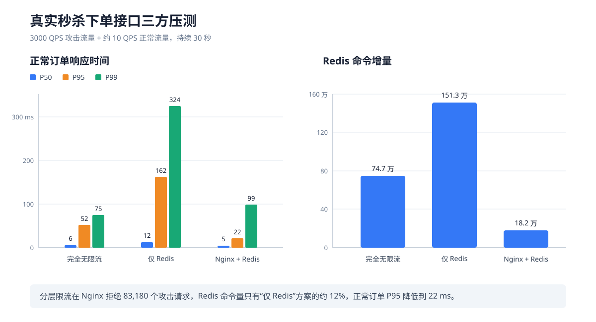

## 流量控制优化：从完全无限流到 Nginx + Redis 分层限流

除了秒杀入口本身的吞吐量之外，这次继续往下测试的时候，我还开始思考另一个问题：

如果系统现在已经能够处理更高的 QPS，是不是就说明它可以直接接收任意多的请求？

答案显然不是。

提高系统的处理能力，解决的是“系统正常情况下能够处理多少请求”；而限流解决的是“当外部流量已经超过系统处理能力时，应该让多少请求进入系统”。这两个问题其实并不冲突。一个系统即使能够处理 8000 QPS，也不代表面对 3 万甚至 10 万 QPS 的恶意流量时，仍然应该把所有请求全部放进 Java、Redis 和 MySQL。

原先项目中没有针对秒杀入口进行专门的流量控制。请求只要通过登录校验，就可以继续进入秒杀链路。正常用户少量访问时，这当然没有问题；但是一旦有人绕过前端，直接通过脚本持续请求接口，那么攻击者发出多少请求，Java 和 Redis 基本就要接收多少请求。

这里真正危险的地方不一定是某一个请求特别慢，而是系统内部需要处理的工作量没有上限。

一次最终失败的秒杀请求，仍然可能消耗 Nginx 连接、Tomcat 工作线程、HTTP 解析、Redis 登录态查询、订单 ID 生成、Lua 脚本执行、Redis 网络连接以及 JVM CPU。攻击请求越多，这些资源就会被占用得越多。等到线程池、Redis 连接池或者网络真正撑不住时再拒绝请求，其实已经太晚了，因为请求在失败之前已经消耗了大量资源。

所以最开始，我先在应用中加入了 Redis 令牌桶，希望在真正执行下单逻辑之前，对请求进行一次控制。

Redis 令牌桶并不是简单地只按 IP 做一次计数。当前限流 Key 中包含了优惠券、业务场景、IP 或者用户等维度。也就是说，申请秒杀资格令牌和真正提交秒杀订单可以使用不同的限流策略；不同优惠券之间也不会共用同一个业务桶；同一个 IP 下的整体请求速度和同一个用户自己的请求速度还可以分别控制。

在当前配置中，秒杀下单场景大致限制为：

1. 同一张券、同一业务场景下，单个 IP 每秒最多放行 200 次；
2. 同一张券、同一业务场景下，普通用户每秒最多放行 2 次；
3. VIP 或高价值用户可以根据配置获得更高的用户桶容量；
4. 令牌的计算和 IP、用户两个桶的更新全部放在同一个 Lua 脚本中原子完成。

这里选择 Redis 而不是直接在 Java 本地做限流，也和多实例部署有关。如果每个实例都维护自己的本地令牌桶，那么部署三个实例之后，实际能够放行的流量可能会变成单实例配置的三倍，而且用户请求被负载均衡到不同实例时，也可能绕开原本的用户限额。Redis 中的令牌桶由所有实例共享，才能保证多个应用实例看到的是同一份限流状态。

到这里，我最开始觉得限流问题应该已经解决了。因为绝大部分恶意请求会被令牌桶拒绝，不会继续执行真正的库存扣减、Handoff 写入和订单落库。

但是实际压测之后，结果却让我产生了怀疑。

当时我最先测试的是申请秒杀 Access Token 的接口。测试结果中，完全关闭限流的接口响应时间竟然比“仅 Redis 令牌桶”更短。这个结果一开始我觉得很不合理。按照我的理解，如果完全不限流，更多无效请求会进入 Redis、占用 Java 线程，那么正常请求应该更慢才对，为什么加了限流反而变慢了？

后来重新梳理请求链路之后，我发现问题并不在测试数据本身，而在于我对测试结果的解释不够准确。

仅使用 Redis 令牌桶时，外部的所有请求仍然已经进入了 Nginx、Tomcat 和 Java。每一个请求还需要先执行一次限流 Lua。令牌桶脚本需要读取限流策略，获取 Redis 服务器时间，计算 IP 桶和用户桶剩余令牌，并更新两个桶的状态和过期时间。即使请求最后返回 HTTP 429，这部分工作也已经发生了。

也就是说，Redis 令牌桶保护了后面的下单业务，但是它自己同样需要消耗 Java 和 Redis 资源。

这让我意识到，仅使用 Redis 限流还有一个很明显的问题：

**它可以保护库存扣减、消息队列和 MySQL，却不能阻止攻击请求进入 Java，也不能保护 Redis 限流层本身。**

因此，限流方案继续从“仅 Redis 令牌桶”演进成了“Nginx + Redis 令牌桶”的分层设计。

Nginx 这一层并不负责理解复杂业务，只按照客户端真实 IP 对秒杀路径进行粗粒度削峰。当前配置为每个来源 IP 约 250 请求/秒，并允许 200 个突发请求。超过范围的请求直接由 Nginx 返回 429，不再进入 Java。与此同时，Nginx 会覆盖客户端伪造的 `X-Forwarded-For`，只把自己实际看到的来源 IP 传给应用，避免攻击者通过伪造请求头绕过 IP 限流。

经过 Nginx 削峰之后，少量进入应用的请求再交给 Redis。Redis 继续按照“优惠券 + 业务场景 + IP + 用户”做更细粒度的判断。

所以这两层限流虽然都包含 IP 维度，但它们并不是简单重复：

- Nginx 面向的是网关入口，目标是用很低的成本挡住大规模流量洪峰，保护 Java 和 Redis；
- Redis 面向的是具体业务，目标是在多实例环境中对不同券、不同场景、不同用户执行统一而精细的限流策略。

如果只保留 Nginx，那么同一个 IP 下大量不同账号的流量虽然能被粗略控制，但是无法限制单个用户，也无法根据优惠券、业务场景、VIP 等条件动态调整策略；如果只保留 Redis，那么所有攻击请求仍然会先进入 Java 和 Redis。两层结合之后，一个负责挡住洪峰，一个负责识别进入系统之后的业务流量。

---

### 为什么这一次重新测试了真正的下单接口

不过，仅仅在 Access Token 申请接口上证明限流有效，我觉得还是不够。因为这个接口本身比较轻，它不能完整代表库存预扣、订单状态写入、ZSet Handoff、Outbox 投递和异步落库这些真正影响秒杀性能的操作。

所以后面我又重新设计了一次测试，直接压测真正的下单接口：

`POST /voucher-order/seckill/{voucherId}`

为了让三组结果尽量可比，这次测试统一使用：

1. 3000 QPS 的攻击流量，持续 30 秒；
2. 500 个攻击用户循环请求，避免只测到同一个用户的固定结果；
3. 约 10 QPS 的正常流量，并且正常请求每一次都更换新的用户，保证它们执行的是真实下单，而不是被“一人一单”提前拒绝；
4. 攻击流量和正常流量分别使用独立的优惠券与来源 IP，避免 Nginx 将正常用户和攻击者计算到同一个 IP 桶中；
5. 攻击券库存设置为 500，正常券库存设置为 1000；
6. 三组统一关闭 Access Token 校验，只比较下单接口本身和限流链路，避免其他变量影响结果。

测试的三种状态分别是：

1. 完全无限流；
2. 仅开启 Redis 令牌桶，通过无 Nginx 限流的入口访问；
3. 开启 Nginx 前置限流，同时保留 Redis 令牌桶。

这里还有一个容易被忽略的问题。秒杀接口返回成功，只表示 Redis Lua 已经预扣库存，并把订单写入 ZSet Handoff，不能直接说明订单已经完成 MySQL 落库。因此测试结束后，我又继续检查了 Handoff、accepted、Outbox 状态、MySQL 最终订单数以及 Redis 和 MySQL 的剩余库存。三组测试最终都满足：接口受理的订单全部落库，Handoff、accepted 与异常隔离区最终清空，Redis 与 MySQL 库存一致，没有出现丢单或者超卖。

最终得到的结果如下：

| 指标 | 完全无限流 | 仅 Redis 令牌桶 | Nginx + Redis |
|---|---:|---:|---:|
| 总请求数 | 90,904 | 90,841 | 90,833 |
| 正常订单受理数 / 最终落库数 | 280 / 280 | 276 / 276 | 280 / 280 |
| 正常请求平均响应时间 | 12.17 ms | 41.21 ms | 9.40 ms |
| 正常请求 P50 | 6 ms | 12 ms | 5 ms |
| 正常请求 P95 | 52 ms | 162 ms | 22 ms |
| 正常请求 P99 | 75 ms | 324 ms | 99 ms |
| Nginx 拒绝的攻击请求 | 0 | 0 | 83,180 |
| Redis 令牌桶拒绝的攻击请求 | 0 | 84,635 | 1,484 |
| Redis 命令增量 | 746,652 | 1,512,625 | 181,880 |
| 测试结束后 Handoff/Outbox 排空时间 | 715 ms | 725 ms | 661 ms |
| 最终 Handoff / accepted / quarantine | 0 / 0 / 0 | 0 / 0 / 0 | 0 / 0 / 0 |

这个结果中最有意思的地方，仍然是完全无限流的正常请求 P95 只有 52 ms，反而比仅 Redis 令牌桶的 162 ms 更低。

但是这并不能说明无限流更好。

这次攻击券只有 500 张库存。最开始的 500 个请求成功预扣库存并写入 Handoff 之后，库存很快就变成了 0。后续 9 万多个攻击请求虽然仍然进入了 Java 和 Redis，但是下单 Lua 读取库存之后就会立即返回“库存不足”，不再执行库存扣减、购买用户写入、Handoff 写入和 MySQL 落库。

换句话说，这次测试中“库存归零”实际上成了一个意外的快速失败条件。无限流组的大部分攻击请求执行的是比较便宜的库存不足路径，而 Redis 限流组的每一个请求都需要先维护 IP 桶和用户桶，所以仅 Redis 组的 Redis 命令量反而达到了 151 万，是无限流组的约 2.03 倍。

这个结果让我对压测有了一个更深的认识：

**测试数据没有错，不代表根据数据得到的结论就一定正确。还必须结合业务链路，判断这次测试真正覆盖了什么。**

本次结果证明的是，在“单张券库存很快售罄”的条件下，库存不足路径比 Redis 精细令牌桶更便宜；它并不能证明无限流架构能够安全承受恶意请求。

如果把攻击券库存提高到 10 万，或者攻击者同时攻击很多张不同的券，那么大量请求就不会再被库存为 0 提前终止。它们可能继续执行 Redis 库存扣减、SADD、ZADD、受理凭证写入，并在后面形成大量需要写入 Outbox、投递 Kafka 和落库的订单事件。这个时候，入口生产速度一旦超过 Relay、消费者和 MySQL 的处理速度，就可能出现 Handoff/Outbox/Kafka 积压、订单长时间处于 PROCESSING、数据库连接池占满以及普通接口被拖慢等问题。

而 Nginx + Redis 组中，83,180 个攻击请求在进入 Java 之前就被拒绝，最后只有约 7373 个攻击请求进入应用。Redis 命令量从仅 Redis 组的 151 万下降到约 18.2 万，只剩下约 12%。正常请求的平均响应时间降低到 9.4 ms，P95 降低到 22 ms。

这里我也不想只挑对结论有利的数据。分层限流组这一次的 P99 是 99 ms，高于完全无限流组的 75 ms，说明少量请求仍然出现了瞬时抖动；而且每组正常样本只有两百多次，一次 30 秒测试也不足以证明所有尾延迟都能稳定降低。如果要得到更加严格的性能结论，还应该在相同环境下重复执行多轮，观察均值、方差和不同分位数是否稳定。

但是从 Nginx 实际拦截的请求量、进入 Java 的攻击请求数、Redis 命令量以及正常请求 P95 来看，分层限流已经比较清楚地证明了它的核心价值：

**它不只是让攻击请求更快失败，而是把系统内部需要承担的工作量控制在一个相对稳定的范围内，为正常请求保留 Java 线程、Redis 连接和 CPU 资源。**

---

整个限流方案的演进可以概括为：

完全无限流：所有请求进入 Java 和 Redis，虽然库存、一人一单和 Lua 能保证业务正确性，但是内部资源消耗没有明确上限。

仅 Redis 令牌桶：能够在多实例环境中按照 IP、用户、优惠券和业务场景精细保护真正的下单链路，但是攻击请求仍然会进入 Java，Redis 限流层本身也需要承受全部外部流量。

Nginx + Redis 分层限流：先在 Nginx 用低成本进行粗粒度削峰，再让 Redis 对少量进入应用的请求做精细控制，最终同时保护 Java、Redis、Handoff、Kafka 和 MySQL。

我觉得这次限流优化比较有价值的地方，并不是简单地在项目中又加入了 Nginx 和令牌桶两个技术名词，而是每一次调整都有对应的问题和测试依据。

先发现完全无限流时系统内部的工作量无法控制；再发现仅 Redis 限流虽然保护了业务，但是所有攻击请求仍然进入 Java 和 Redis；最后才增加 Nginx 前置削峰，并重新用真正的下单接口验证三种方案。

这也让我越来越觉得，一个技术方案是否合理，不能只看它使用了多少中间件，也不能只看某一次压测中的单个数字。更重要的是先弄清楚它到底想保护什么资源、在哪一层生效、付出了什么成本，以及最终有没有通过相同条件下的数据证明它确实解决了原来的问题。
